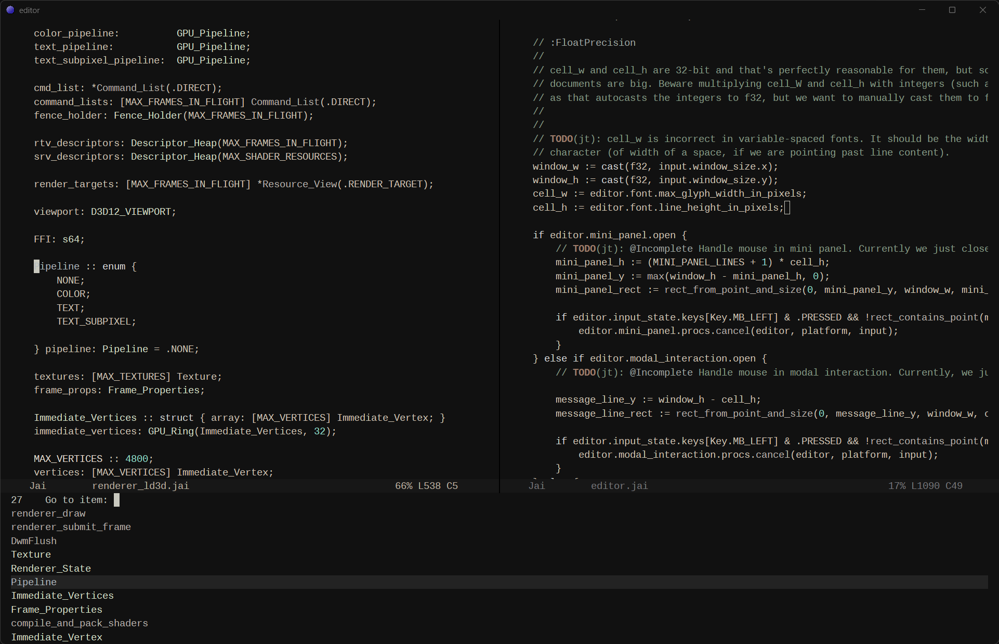

> 🛈 **Divergence Log:**
>
> minibuffer history (M-p, M-n)
>
> config file and runtime macros (F3 > F4)
>
> imenu (M-g-i)
>
> extended syntax and comment highlighting

# My editor

This is a small text editor I wrote for my personal use. The design goals are roughly:

- Small and simple, so I can make modifications with understanding.
- Fast, unless it conflicts too much with the previous point.
- Preserve the nice parts of my Emacs experience.



If you want to make this editor yours, there's two options:

1) Use a binary build and customize `editor.config`. There's a few starter templates,
   depending on where you are coming from, but note that these don't map precisely
   to their source behavior.

2) Modify the code and compile your own build.

## Building from source

Make a debug build with:

```
jai [-x64] build.jai
```

The binary releases are compiled with:

```
jai -optimized_debug build.jai - [-bundle] [-no-sanity] [-no-windows-console] 
```

The build file contains information about more options.

Tested on Jai version `0.2.030`.

The code compiles and runs on Windows and macOS (although macOS bundle doesn't work yet).
Linux support coming soon.

The editor is written in Jai, which is not publicly available yet. Hopefully it will be soon.

## Temporary limitations

This is an early alpha. Bugs and occasional crashes may happen. Save often.

**Language support**

Only C/C++, Jai, and GLSL are supported right now. I plan to add support for more languages soon.
If you want to add support for a language for yourself, look at the existing `lang_xyz.jai` files.

**Performance**

The parser for indentation and lexers for syntax highlighting need to get faster.
The editor turns them off for files above 10 megabytes.

**Misc**

- Project search currently shells out to [ripgrep](https://github.com/burntsushi/ripgrep).
  Near-term, more external search tools will be supported (e.g. `git grep`).
  Long-term, project search will be implemented in the editor itself.

- Spawning a process and collecting its output (for compilation or project search) is synchronous for now.

## Contributing

Small bugfixes are accepted, as well as lexers for new programming languages, but if you want to make
bigger changes, your own version of the editor would be a better place to do that.

LSPs and MCPs are out of scope. Vim mode too.

## Acknowledgements

- Jonathan Blow, for making the Jai programming language.
- [Emacs](https://www.gnu.org/software/emacs/), for teaching me that I can live without IDEs.
- [Emacs](https://www.gnu.org/software/emacs/), for getting slower and buggier over time, making me do this.
- [Focus Editor](https://focus-editor.dev/), with which this editor shares the simplicity philosophy.
  If I had tried it sooner, I might have just used that.
- My amazing partner, who tolerated me going off on this tangent instead of doing more important stuff.

## License

The editor is in the public domain under the MIT license. You can do whatever with it. Attribution is appreciated.